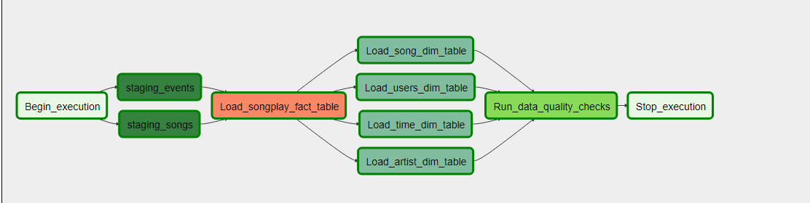

# Data Pipeline With Airflow
 A Airflow project for the Udacity Data Engineer NanoDegree

 This README file includes a summary of the project, how to run the Python scripts, and an explanation of the files in the repository.

 ## Getting Started

 1.  You will need to launch and configure a Redshift Database in AWS.  Enter the endpoint, database name, user account, user password, and port information into your configuration file.  An example configuration file is provided.  Ensure your configurtaion file is added to your .gitignore file.  

 2.  Next build the database tables in Redshift.  To do this run the following command:
> python create_tables.py

 3.  Launch Airflow and add your credential information to the server and enable the DAG.  An example of a successfully run DAG can be seen below

 

 ## Purpose
 The purpose of this database is to conduct ETL operations and store data from user activity from the Sparkify app.  
 This data will be used by the Sparkify analytics team will use this data gain a greater understanding of user activity and songs being listened to.

 ## Database Schema
 There are 5 tables in the database.  This design focuses on the songplay table which houses the most important information for the analytics team.  The supporting tables of time, users, songs, and artists help to provide context and additional details for the songplay table.

 There are two staging tables **staging_events** and the **staging_songs** tables.  These tables are to temporally hold data from the S2 Bucket before being transformed and inserted into the primary use tables.

 The **staging_songs** table contains:

 | Field           | Data Type          |
  |-------------  | -------------         |
 | artist_id            | VARCHAR                    |
 | artist_latitude   | NUMERIC                   |
 | artist_location  | VARCHAR                 |
 | artist_longitude | NUMERIC                  |
 | artist_name        | VARCHAR                 |
 | duration              | FLOAT                  |
 | num_songs         | INTEGER                   |
 | song_id               | VARCHAR                |
 | title                     | VARCHAR                 |
 | year                    | INTEGER                 |

  The **staging_events** table contains:

  | Field           | Data Type          |
   |-------------  | -------------         |
  | artist             | VARCHAR                    |
  | auth     | VARCHAR                  |
  | first_name  | VARCHAR                 |
  | gender | VARCHAR                  |
  | item_in_session       | INTEGER                 |
  | last_name        | VARCHAR                 |
  | length            | NUMERIC                  |
  | level          | VARCHAR                |
  | location              | VARCHAR                |
  | method                    | VARCHAR                |
  | page                  | VARCHAR                 |
  | registration           | BIGINT                  |
  | session_id          | INTEGER                   |
  | song              | VARCHAR                |
  | status                     | INTEGER            |
  | ts                  | TIMESTAMP               |
  | user_agent                     | VARCHAR  |
  | user_id                 | INTEGER                 |

The use tables are the **songplay_fact**, **time_dim**, **user_dim**, **song_dim**, and **artist_dim** tables.  These tables are in the

 The **time table** which contains:

 | Field        | Data Type          | 
  |-------------  | ------------- |
 | start_time      | TIMESTAMP |
 | hour      | INTEGER     |
 | day | INTEGER      |  
 | week | INTEGER      |  
 | month | INTEGER      |    
 | year | INTEGER     |   
 | weekday | INTEGER     |   

 The **users table** which contains:

 | Field        | Data Type          |
 | ------------- | ------------- |  
 | user_id      | INTEGER |
 | first_name      | VARCHAR      |
 | last_name | VARCHAR      |
 | gender | VARCHAR      |  
 | level | VARCHAR     |  

 The **songs table** which contains:

 | Field        | Data Type          |
 | ------------- | ------------- |  
 | song_id      | VARCHAR |
 | title      | VARCHAR      |  
 | artist_id | VARCHAR      |  
 | year | INT      |  
 | duration | NUMERIC     |  

 The **artists table** which contains:

 | Field        | Data Type          |
 | ------------- | ------------- |  
 | artist_id      | VARCHAR |
 | name      | VARCHAR      |   
 | location | VARCHAR      |   
 | latitude | NUMERIC      |  
 | longitude | NUMERIC   |  

 The **songplay table** which contains:

 | Field        | Data Type          |
 | ------------- | ------------- |  
 | songplay_id      | INT |
 | start_time      | TIMESTAMP    |  
 | user_id | INTEGER  |
 | song_id | VARCHAR      |  
 | artist_id | VARCHAR     |  
 | session_id | INT  |  
 | location | VARCHAR      |
 | user_agent | VARCHAR     |

 

## File Description

- create_tables.py
 - This file is used to connect to the Redshift Cluster and create the database tables.  This file uses the sql_queries.py file for the actual SQL queries.

- sql_queries.py
 - The file contains the sql queries to create the tables in the Redshift Cluster.

- create_tables.py
 - This file is used to create the staging and use tables in Redshift.  It will import the create table queries from the sql_queries.py.  To execute this file use the following command:
